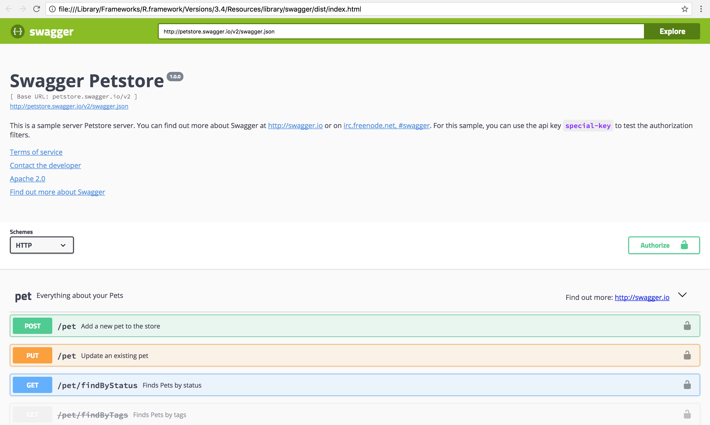

[](https://cran.r-project.org/package=swagger)
[](https://travis-ci.org/schloerke/swagger)

Swagger is a collection of HTML, Javascript, and CSS assets that
dynamically generate beautiful documentation from a Swagger-compliant API.

The main purpose of this package is to enable package authors to create
APIs that are compatible with [swagger.io](https://swagger.io/) and
[openapis.org](https://www.openapis.org/).

Package authors providing web interfaces can serve the static files
from `swagger_path()` using [httpuv](https://github.com/rstudio/httpuv) or
[fiery](https://github.com/thomasp85/fiery). As a start, we can also
browse them by running:

```{r eval=FALSE}
library(swagger)
browseURL(swagger_index())
```



To learn more about Swagger visit: [swagger.io/swagger-ui](https://swagger.io/swagger-ui/)
